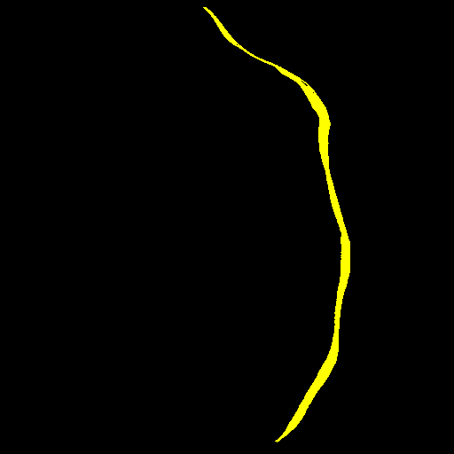

<h2>TensorFlow-FlexUNet-Image-Segmentation-Ridge-in-Retinopathy-of-Prematurity (2025/10/26)</h2>
<!--
Toshiyuki Arai 
Software Laboratory antillia.com  
 -->
This is the first experiment of Image Segmentation for 
<b>Ridge-in-Retinopathy-of-Prematurity (HVDROPDB-RIDGE) </b>, based on 
our <a href="./src/TensorFlowFlexUNet.py">TensorFlowFlexUNet</a>
 (<b>TensorFlow Flexible UNet Image Segmentation Model for Multiclass</b>)
 and a 512x512 pixels 
<a href="https://drive.google.com/file/d/1h-RYrq3zd69z0-FWnMrW-SIVAD6yZJQF/view?usp=sharing">
Augmented-HVDROPDB-Ridge-ImageMask-Dataset.zip</a>
, which was derived by us from    <b>HVDROPDB-RIDGE</b> subset of <b>HVDROPDB_RetCam_Neo_Segmentation</b> in  
<a href="https://data.mendeley.com/datasets/xw5xc7xrmp/3">
HVDROPDB Datasets for Classification and Segmentation for Research in Retinopathy of Prematurity, Ranjana Agrawal
</a>
 
 
<b>Data Augmentation Strategy</b> 
To address the limited size of images and masks of <b>HVDROPDB-RIDGE</b> subset of <b>HVDROPDB_RetCam_Neo_Segmentation</b>, 
we used our offline augmentation tool <a href="https://github.com/sarah-antillia/ImageMask-Dataset-Offline-Augmentation-Tool"> 
ImageMask-Dataset-Offline-Augmentation-Tool</a> and 
<a href="https://github.com/sarah-antillia/Barrel-Image-Distortion-Tool">Barrel-Image-Distortion-Tool <a> to augment the subset.
  

<b>Actual Image Segmentation for Images of 512x512 pixels</b> 
As shown below, the inferred masks predicted by our segmentation model trained on the 
our dataset appear similar to the ground truth masks. 
 
<table>
<tr>
<th>Input: image</th>
<th>Mask (ground_truth)</th>
<th>Prediction: inferred_mask</th>
</tr>
<tr>
<td></td>
<td></td>
<td></td>
</tr>

<tr>
<td></td>
<td></td>
<td></td>
</tr>

<tr>
<td></td>
<td></td>
<td></td>
</tr>
</table>

 

<h3>1. Dataset Citation</h3>
The dataset used here was obtained from the following 
<a href="https://data.mendeley.com/datasets/xw5xc7xrmp/3">
HVDROPDB Datasets for Classification and Segmentation for Research in Retinopathy of Prematurity, Ranjana Agrawal
</a>
  
<b>Contributors:</b> 
Ranjana Agrawal,Sucheta Kulkarni
  

<b>Description</b> 
HVDROPDB_RetCam_Neo_Segmentation and HVDROPDB_RetCam_Neo_Classification are the first datasets to be published for the retinal structure 
segmentation to identify the Retinopathy of Prematurity (ROP).  
They are prepared by screening the preterm infants visiting PBMA's H.V. Desai Eye Hospital, Pune with two diverse imaging systems 
RetCam and Neo.  The Segmentation dataset contains sub-datasets for the segmentation of optic disc, blood vessels, 
and demarcation line/ridge from the fundus images of preterm infants, annotated by a group of ROP experts.  
Each sub-dataset contains retinal fundus images of premature infants with the ground truths prepared manually to assist 
researchers in developing an explainable automated ROP screening system.  
The Classification sub-datasets contain ROP and Normal images.
 
 
<b>Related Identifiers*</b> 
<a href="https://www.sciencedirect.com/science/article/pii/S2352340923009010?via%3Dihub">
HVDROPDB datasets for research in retinopathy of prematurity</a>
  

<b>Licence</b> 
<a href="https://interoperable-europe.ec.europa.eu/licence/creative-commons-attribution-40-international-cc-40">
CC BY 4.0
</a>
 
 
<h3>
2 HVDROPDB Ridge ImageMask Dataset
</h3>
<h4>2.1 Download HVDROPDB-Ridge-PNG-ImageMask-Dataset</h4>
 If you would like to train this HVDROPDB-Ridge Segmentation model by yourself,
 please download  our dataset <a href="https://drive.google.com/file/d/1h-RYrq3zd69z0-FWnMrW-SIVAD6yZJQF/view?usp=sharing">
 Augmented-HVDROPDB-Ridge-PNG-ImageMask-Dataset.zip  </a> on the google drive
, expand the downloaded and put it under <b>./dataset</b> folder to be. 
<pre>
./dataset
└─HVDROPDB-Ridge
    ├─test
    │   ├─images
    │   └─masks
    ├─train
    │   ├─images
    │   └─masks
    └─valid
        ├─images
        └─masks
</pre>
 
<b>HVDROPDB-Ridge Statistics</b> 
 
 
As shown above, the number of images of train and valid datasets is not large  to use for a training set of our segmentation model.
 
 
<h4>2.2 HVDROPDB Ridge Dataset Derivation</h4>
The original dataset folder structure <b>HVDROPDB_RetCam_Neo_Segmentation</b> is the following. 
<pre>
./HVDROPDB_RetCam_Neo_Segmentation
├─HVDROPDB-BV
├─HVDROPDB-OD
└─HVDROPDB-RIDGE
</pre>
We derived the Augmented HVDROPDB-Ridge  2 classes (Neo and RetCam) dataset from the following <b>HVDROPDB-RIDGE</b> subset of <b>HVDROPDB_RetCam_Neo_Segmentation</b> .
<pre>
./HVDROPDB-RIDGE
├─Neo_Ridge_images
├─Neo_Ridge_masks
├─RetCam_Ridge_images
└─RetCam_Ridge_masks
</pre>

<h4>2.3 Train Dataset</h4>

<b>Train_images_sample</b> 

 
<b>Train_masks_sample</b> 

 

<h3>
3 Train TensorFlowUNet Model
</h3>
 We trained HVDROPDB-Ridge TensorFlowFlexUNet Model by using the following
<a href="./projects/TensorFlowFlexUNet/HVDROPDB-Ridge/train_eval_infer.config"> <b>train_eval_infer.config</b></a> file.  
Please move to ./projects/TensorFlowFlexUNet/HVDROPDB-Ridgeand run the following bat file. 
<pre>
>1.train.bat
</pre>
, which simply runs the following command. 
<pre>
>python ../../../src/TensorFlowFlexUNetTrainer.py ./train_eval_infer.config
</pre>

<b>Model parameters</b> 
Defined a small base_filters=16 and large base_kernels=(9,9) for the first Conv Layer of Encoder Block of 
<a href="./src/TensorFlowFlexUNet.py">TensorFlowFlexUNet.py</a> 
and a large num_layers (including a bridge between Encoder and Decoder Blocks).
<pre>
[model]
image_width    = 512
image_height   = 512
image_channels = 3

num_classes    = 3

base_filters   = 16
base_kernels   = (9,9)
num_layers     = 8
dropout_rate   = 0.04
dilation       = (1,1)

</pre>

<b>Learning rate</b> 
Defined a small learning rate.  
<pre>
[model]
learning_rate  = 0.00007
</pre>

<b>Online augmentation</b> 
Disabled our online augmentation.  
<pre>
[model]
model         = "TensorFlowFlexUNet"
generator     = False
</pre>

<b>Loss and metrics functions</b> 
Specified "categorical_crossentropy" and <a href="./src/dice_coef_multiclass.py">"dice_coef_multiclass"</a>. 
<pre>
[model]
loss           = "categorical_crossentropy"
metrics        = ["dice_coef_multiclass"]
</pre>
<b>Learning rate reducer callback</b> 
Enabled learning_rate_reducer callback, and a small reducer_patience.
<pre> 
[train]
learning_rate_reducer = True
reducer_factor     = 0.4
reducer_patience   = 4
</pre>

<b>Early stopping callback</b> 
Enabled early stopping callback with patience parameter.
<pre>
[train]
patience      = 10
</pre>

<b>RGB Color map</b> 
rgb color map dict for HVDROPDB-Ridge 1+2 classes.
<pre>
[mask]
mask_datatype    = "categorized"
mask_file_format = ".png"
;                     Neo:yellow,   RetCam: cyan
rgb_map = {(0,0,0):0,(255,255,0):1, (0,255,255):2,}
</pre>

<b>Epoch change inference callback</b> 
Enabled <a href="./src/EpochChangeInferencer.py">epoch_change_infer callback (EpochChangeInferencer.py)</a></b>. 
<pre>
[train]
epoch_change_infer       = True
epoch_change_infer_dir   =  "./epoch_change_infer"
num_infer_images         = 6
</pre>

By using this callback, on every epoch_change, the inference procedure can be called
 for 6 images in <b>mini_test</b> folder. This will help you confirm how the predicted mask changes 
 at each epoch during your training process.    

<b>Epoch_change_inference output at starting (epoch 1,2,3)</b> 
 
 
<b>Epoch_change_inference output at middlepoint (epoch 30,31 32)</b> 
 
 

<b>Epoch_change_inference output at ending (epoch 61,62,63)</b> 
 
 

In this experiment, the training process was terminated at epoch 63.  
 
 

<a href="./projects/TensorFlowFlexUNet/HVDROPDB-Ridge/eval/train_metrics.csv">train_metrics.csv</a> 
 

 
<a href="./projects/TensorFlowFlexUNet/HVDROPDB-Ridge/eval/train_losses.csv">train_losses.csv</a> 
 

 

<h3>
4 Evaluation
</h3>
Please move to a <b>./projects/TensorFlowFlexUNet/HVDROPDB-Ridge</b> folder, 
and run the following bat file to evaluate TensorFlowUNet model for HVDROPDB-Ridge. 
<pre>
./2.evaluate.bat
</pre>
This bat file simply runs the following command.
<pre>
python ../../../src/TensorFlowFlexUNetEvaluator.py ./train_eval_infer.config
</pre>

Evaluation console output: 

  Image-Segmentation-HVDROPDB-Ridge

<a href="./projects/TensorFlowFlexUNet/HVDROPDB-Ridge/evaluation.csv">evaluation.csv</a> 

The loss (categorical_crossentropy) to this HVDROPDB-Ridge/test was low, and dice_coef_multiclass high as shown below.
 
<pre>
categorical_crossentropy,0.0125
dice_coef_multiclass,0.9939
</pre>
 
<h3>
5 Inference
</h3>
Please move to a <b>./projects/TensorFlowFlexUNet/HVDROPDB-Ridge</b> folder 
,and run the following bat file to infer segmentation regions for images by the Trained-TensorFlowUNet model for HVDROPDB-Ridge. 
<pre>
./3.infer.bat
</pre>
This simply runs the following command.
<pre>
python ../../../src/TensorFlowFlexUNetInferencer.py ./train_eval_infer.config
</pre>

<b>mini_test_images</b> 
 
<b>mini_test_mask(ground_truth)</b> 
 

<b>Inferred test masks</b> 
 
 

<b>Enlarged images and masks </b> 

<table>
<tr>
<th>Image</th>
<th>Mask (ground_truth)</th>
<th>Inferred-mask</th>
</tr>

<tr>
<td></td>
<td></td>
<td></td>
</tr>

<tr>
<td></td>
<td></td>
<td></td>
</tr>

<tr>
<td></td>
<td></td>
<td></td>
</tr>
<tr>
<td></td>
<td></td>
<td></td>
</tr>
<tr>
<td></td>
<td></td>
<td></td>
</tr>
<tr>
<td></td>
<td></td>
<td></td>
</tr>

</table>

 

<h3>
References
</h3>
<b>1. Assistive Framework for Automatic Detection of All the Zones in Retinopathy of Prematurity Using Deep Learning</b> 
Ranjana Agrawal, Sucheta Kulkarni, Rahee Walambe & Ketan Kotecha 
<a href="https://link.springer.com/article/10.1007/s10278-021-00477-8">https://link.springer.com/article/10.1007/s10278-021-00477-8</a>
 
 
<b>2. Retinopathy of Prematurity</b> 
Ranjana Agrawal, Sucheta Kulkarni, Rahee Walambe & Ketan Kotecha 
<a href="https://www.nei.nih.gov/learn-about-eye-health/eye-conditions-and-diseases/retinopathy-prematurity">
https://www.nei.nih.gov/learn-about-eye-health/eye-conditions-and-diseases/retinopathy-prematurity</a>
 
 
<b>3.HVDROPDB datasets for research in retinopathy of prematurity</b> 
Ranjana Agrawal, Rahee Walambe, Ketan Kotecha, Anita Gaikwad, 
Col. Madan Deshpande, Sucheta Kulkarni
 
<a href="https://www.sciencedirect.com/science/article/pii/S2352340923009010?via%3Dihub">
https://www.sciencedirect.com/science/article/pii/S2352340923009010?via%3Dihub
</a>
 
 

